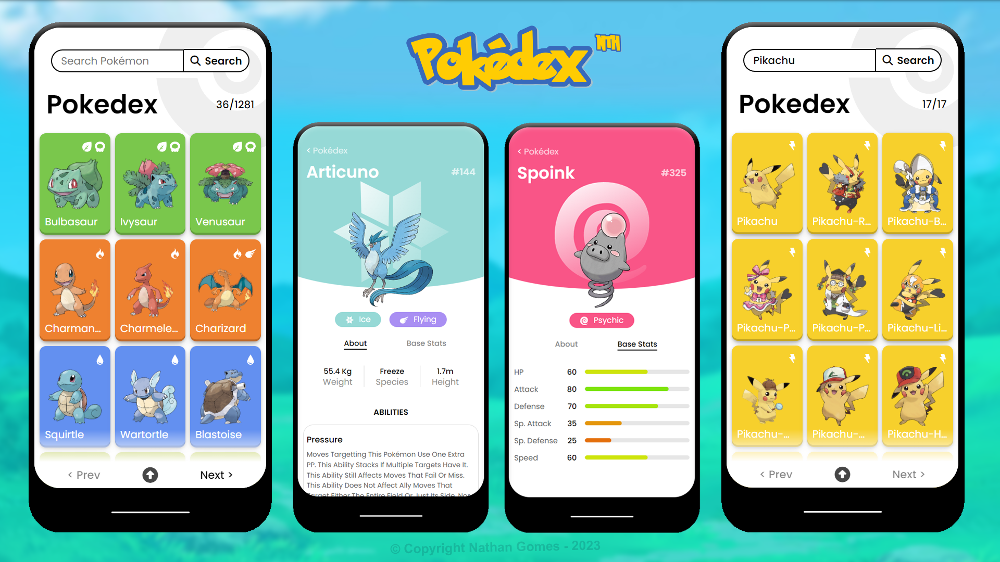

# Pokédex Online
Bem-vindo à minha Pokedex Online, construída a partir da PokéAPI! Neste projeto, explorei o vasto universo de Pokémon ao criar uma plataforma que oferece informações detalhadas sobre várias espécies de Pokémon.

  

## 🚀 Começando

Para acessar e testar nosso protótipo, basta clonar ou abrir o projeto no Pycharm. Ao iniciar o app.py, rapidamente terá acesso à condição meteorológica desejada!

### 📋 Pré-requisitos

Um dispositivo capaz de executar arquivos em python, de preferencia o Pycharm!

### 🔧 Instalação

pip install:

Framework: Flask 
Biblioteca: requests, aiohttp, beautifulsoup4

## 🛠️ Construído com

<h3 align="left">Idiomas e ferramentas:</h3>

        

## ✒️ Autor

[@NathanGomes13](https://nathan-gomes.netlify.app/)

## 📄 Licença

Este projeto está sob a licença (MIT license) - veja o arquivo [LICENSE.md](https://github.com/NathanGomes13/poke_api/blob/main/LICENSE) para detalhes.

## 🎁 Apoie-me comprando um café!

  
